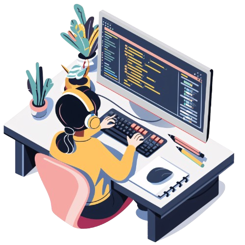

<div align="center">


<a href="mailto:keerthisr0102@gmail.com">
  
</a>
<a href="https://www.linkedin.com/in/keerthi-s-r-57036b289/">
  
</a>
<a href="https://github.com/Keerthisgr">
  
</a>
<a href="https://portfolio-m1ni.vercel.app/">
  
</a>

<br/>



<br/>


</div>

---

### 🚀 About Me

I'm an MCA graduate who builds end-to-end web applications with **Java, Spring Boot/MVC, Hibernate, and MySQL** — and enjoys the occasional detour into **Python and IoT** when a problem calls for it. My IoT-based Parkinson's detection project was published in the *Journal of Engineering and Management (JNNCE)*, and I'm currently looking for an entry-level Full Stack role where I can turn training into real production impact.

```java
public class Keerthi extends Developer {
    String[] stack = {"Java", "Spring Boot", "Hibernate", "MySQL", "JavaScript"};
    String currentFocus = "Backend architecture & REST API design";
    boolean openToWork = true;
}
```

---

### 🛠 Tech Stack

<p>
  
  
  
  
</p>
<p>
  
  
  
  
</p>
<p>
  
  
  
</p>
<p>
  
  
  
  
</p>

---

### 💼 Experience

**Java Full Stack Developer Trainee** — [X-Workz ODC](https://x-workz.in/) · *Aug 2024 – Mar 2025*
- Built end-to-end CRUD applications with Spring MVC, Hibernate, and MySQL, wiring REST APIs to dynamic front-end views.
- Optimized data access with JDBC/JPA and Hibernate ORM mappings across multiple entity relationships.

**Frontend Development Intern** — [JSpiders](https://jspiders.com/) · *Oct 2023 – Jan 2024*
- Built responsive UI components with HTML, CSS, and JavaScript; integrated frontend views with REST APIs.

---


### 📊 GitHub Stats

<p align="center">
  
  
</p>

<p align="center">
  
</p>

<p align="center">
  
</p>

<div align="center">

📫 Reach me at **keerthisr0102@gmail.com** &nbsp;·&nbsp; open to entry-level Full Stack / Backend roles


</div>
